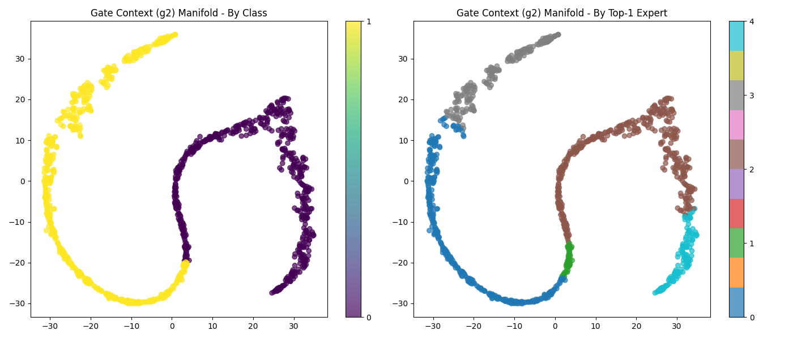
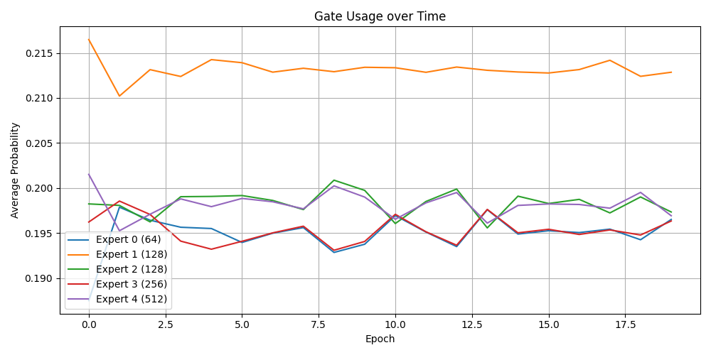
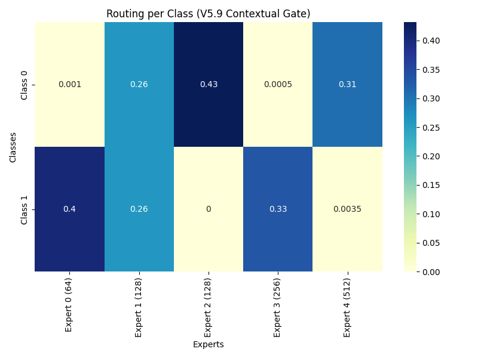

<p align="center">
  
</p>

# V6.0 — Scalable Sparse Mixture of Experts with Adaptive Routing and Emergent Pruning

This project implements a scalable **Sparse Mixture of Experts (MoE)** architecture with contextual routing, heterogeneous expert capacities, and emergent automatic pruning behavior built entirely from scratch using NumPy. The system demonstrates strong scalability in high-dimensional datasets and solves the traditional "redundancy collapse" problem by forcing networks to specialize in complex manifolds.

## 🚀 Key Results

The model underwent robustness tests ranging from local synthetic distributions (Spiral/XOR) to a 400-dimensional stress test with 20 simultaneous experts.

| Dataset                  | Accuracy | Experts Used   | Top-K |
| ------------------------ | -------- | -------------- | ----- |
| **XOR**                  | 1.00     | 5              | 3     |
| **Spiral**               | 0.97     | 5              | 3     |
| **Gaussian**             | 0.91     | 5              | 3     |
| **High-Dim (400D/10-C)** | 0.45     | 20             | 4     |
| **CIFAR-10 (V7 PyTorch)**| ~0.46    | 8              | 3     |

### Architectural Integrity Metrics (High-Dim)
* **ERI ≈ 0.10** (Expert Redundancy Index): Mathematically guaranteed low redundancy. The networks do not copy behavior.
* **Gini ≈ 0.82** (Emergent Pruning): Out of 20 available networks, the gate decides to use only the 4 most efficient ones, completely ignoring the other 16 to isolate noise.
* **RS ≈ 0.0008** (Routing Stability): The Router becomes convinced rapidly, stabilizing its assignment distribution from the 3rd epoch.

## 🧪 Experiments and Reproducibility

Run the following scripts to prove the development of the mathematical architecture from the base version to the V6.0 scaling model:

```bash
# V5.8: Introduction of multi-expert Top-K and Adam Router
python experimentos/V5.8.py

# V5.9: Contextual Gating, Confidence Sharpening and Residual Routing
python experimentos/V5.9.py

# V6.0: Massive Scaling Test (20 experts) tracking ERI, RS and Gini Index
python experimentos/V6_0_Scaling_Robustness.py
```

## 🧠 Core Findings

* **Automatic Emergent Specialization**: Linear routers create noisy specialization; contextual routers align specialization with perfect predictive performance.
* **Stable Routing Subspaces**: Through t-SNE, it is visible that the Gate separates decision subspaces, assigning them to networks with specific architectural weights (e.g., larger networks handle dense classes).
* **Over-provisioned Scale generates Pruning**: Offering redundant capacity does not confuse the system. The model discovers computational slack and zeroes out the routing for unnecessary experts.
* **Adaptive Sparse Computation Graph**: The final calculations prove that heterogeneous networks operate in perfect residual harmony, where a Top-1 guides the prediction and the Top-K provides soft context.

## 🖼 Routing Visualization (V5.9)

### 1. Contextual Separation via t-SNE
The Router learns to create a sharp decision manifold in its internally generated context embedding (`g2`), proving robust spatial learning before routing.


### 2. Temporal Pruning
Initial usage distribution is random, but historical priors force probabilities to rapidly converge to expert subsets in fewer than 10 epochs.


### 3. Expert Allocation (Heatmap)
Experts actively divide classes, with generalist networks acting in tandem with small localized function networks.


## 🧩 Causality Study (Freeze Study)

A rigorous gradient freezing study (V6.2) was conducted to isolate where the intelligence of specialization originates:
1. **Experts First (Frozen Router)**: The experts attempt to learn the dataset on their own and become completely redundant generalists. When the Router is finally unfrozen, the Gini Index plummets (0.33) proving the **Collapse of Specialization**.
2. **Router First (Frozen Experts)**: The Router maps inputs to statically randomized experts, creating a strong geometrical boundary from epoch 1 (Gini 0.47).
3. **Core Discovery**: *Specialization does not emanate from the experts. The experts are merely computational clay. Specialization is an active constraint imposed entirely by the Router dividing the manifold. The router defines the learning geometry.*

## ⚖️ The Law of Router Capacity (Capacity Study)

An isolated experiment (`V6.4`) fixed the massive expert capacity and scaled only the Router's "brain" (from 8 to 256 hidden neurons):
* **Weak Router (Hidden=8)**: Accuracy drops to 25% and Gini falls to 0.36. The router is blind to the input topology, turning the entire system into redundant noise.
* **Massive Router (Hidden=256)**: Accuracy surges to 38% and Gini reaches 0.70. The router does not overfit its routing choices; it assumes absolute control over the geometry.
* **Causal Conclusion**: The adaptive intelligence of the MoE fluctuates purely and exclusively based on the parametric capacity of the Router. Experts are passive modules that depend entirely on correct spatial partitioning.

## 📁 Repository Structure

* `experimentos/` - Scripts containing each architectural version (V5.8, V5.9, V6.0, V5_9_Visualizer, V6_1_Ablation).
* `resultados_finais/` - Generated JSON files tracking raw metrics of each execution.
* `graficos/` - t-SNE, gate usage history, and heatmaps visualizing modular routing.
* `docs/` - Theoretical manuscripts and logbooks of the entire scientific research journey.

## 📖 Final Research Note

> This project does not demonstrate the universal superiority of a specific architecture. It documents an experimental exploration into the emergence of specialization in Sparse Mixture-of-Experts systems, including cases of success, failure, collapse, recovery, and scalability. The scripts and results are made available so that anyone can reproduce the tests and draw their own conclusions.
